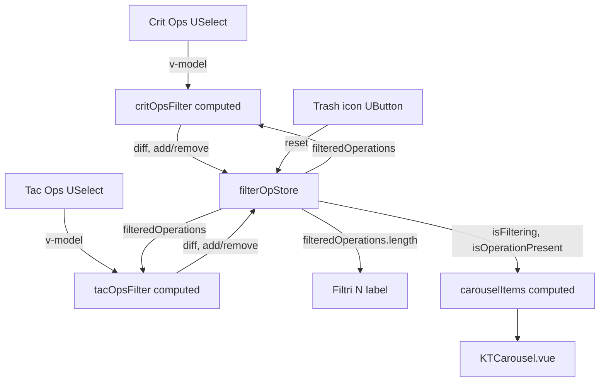

# Requirements

### Overview & Goals
The Crit/Tac Ops catalog/filter store split is complete: `critTacOps.js` owns the read-only catalog and already exposes `getCritOpsFilterItems`/`getTacOpsFilterItems`, and `CritTacOps.vue` renders them into two `USelect`s (`critOpsFilter`/`tacOpsFilter`). Those selects are currently disconnected placeholders — plain local `ref([])`s with no link to `filterOpStore` — so selecting an item has no effect on the carousel.

Goal: wire `critOpsFilter`/`tacOpsFilter` to `filterOpStore` so selecting/deselecting Crit/Tac Ops updates `filterOpStore.filteredOperations`, which `carouselItems`'s existing `!filterOpStore.isFiltering || filterOpStore.isOperationPresent(el.id)` guard already consumes — completing the end-to-end filter feature.

### Scope
**In scope**
- Fix the broken `getCritOpsFilterItems`/`getTacOpsFilterItems` computeds in `critTacOps.js` (bug found during review — see Technical Design).
- Wire `critOpsFilter`/`tacOpsFilter` bidirectionally to `filterOpStore.filteredOperations`, with the store as the single source of truth.
- Wire the existing unwired trash-icon `UButton` to clear all active filters.
- Make the "Filtri (1)" toggle button label show the real, live count of active filters.

**Out of scope**
- Any change to `critTacOpsStore`'s catalog data (`critOps`/`tacOps`) or to `CritCard.vue`/`TacCard.vue`/`OpCard.vue`.
- Any change to `filterOpStore`'s persisted shape (`persist: true`) or its existing `addOperationFilter`/`removeOperationFilter`/`isOperationPresent`/`isFiltering`/`$reset` API — this task only calls that existing API from the UI, it doesn't change it.
- The `carouselItems` guard logic itself in `CritTacOps.vue` — already correct and left unchanged.

### User Stories
- As a user, I want to pick one or more Crit Ops and/or Tac Ops from the filter dropdowns, so the carousel only shows the operations I'm interested in.
- As a user, I want a single click on the trash-icon button to clear every active filter, so I don't have to manually deselect each item.
- As a user, I want the "Filtri" button to show me how many filters are currently active, so I know at a glance whether a filter is applied.
- As a developer, I want the two selects to always reflect `filterOpStore`'s actual state, so any future reset/clear action elsewhere in the app keeps the UI consistent without extra wiring.

### Functional Requirements
- Selecting an item in the Crit Ops or Tac Ops `USelect` adds its `id` to `filterOpStore.filteredOperations` (via `addOperationFilter`); deselecting removes it (via `removeOperationFilter`).
- The carousel immediately reflects the new selection, via the existing `carouselItems` guard, once `filteredOperations` is populated.
- The Crit Ops select only ever adds/removes Crit Op ids; the Tac Ops select only ever adds/removes Tac Op ids — selecting in one never touches the other's ids.
- Clicking the trash-icon button empties `filterOpStore.filteredOperations` and visually deselects both `USelect`s.
- The "Filtri (N)" label always shows the current count of `filterOpStore.filteredOperations`.
- `getCritOpsFilterItems`/`getTacOpsFilterItems` produce one entry per catalog operation with a human-readable label (the op's `title`) and its `id` as the selectable value.

# Technical Design

### Current Implementation
- `src/stores/critTacOps.js`: `useCritTacOpsStore` now also exposes `getCritOpsFilterItems`/`getTacOpsFilterItems`, but both are **broken**: `for (const el in critOps.value)` iterates the array's numeric indices as strings, not its elements, so `el.id`/`el.name` are `undefined` for every entry. Also `el.name` doesn't exist on `CritOp`/`TacOp` — per `CardModels.js`'s `BaseOp`, the field is `title`. Today `critFilterItems`/`tacFilterItems` in `CritTacOps.vue` resolve to arrays of `{id: undefined, name: undefined}`, which would render blank/unusable options.
- `src/views/CritTacOps.vue`: `critOpsFilter`/`tacOpsFilter` are plain local `ref([])`s bound via `v-model` to the two `USelect`s, with nothing connecting them to `filterOpStore` — selecting an item currently has no effect beyond the local `ref`.
- `carouselItems` already reads `filterOpStore.isFiltering`/`isOperationPresent(el.id)` correctly (confirmed in the prior plan iteration) — this part needs no change.
- `filterOpStore` (`src/stores/filterOperations.js`) already exposes everything needed: `addOperationFilter(opId)`, `removeOperationFilter(opId)`, `isOperationPresent` (a computed returning a predicate), `isFiltering`, `filteredOperations`, and `$reset()`.
- The template's trash-icon `UButton` next to the "Filtri (1)" toggle has no `@click` handler, and the `(1)` in that label is a hardcoded string, not derived from any state.
- `@nuxt/ui` v3 (per `package.json`) `USelect` expects `items` as objects with `label`/`value` keys by default; with `multiple`, `v-model` holds the array of selected `value`s — confirmed against the Nuxt UI v3 Select docs.

### Key Decisions
1. **`filterOpStore` is the single source of truth for the selects; `critOpsFilter`/`tacOpsFilter` become writable `computed` proxies, not local refs.** The getter derives the currently-selected ids by intersecting `filterOpStore.filteredOperations` with that select's own item ids; the setter diffs the new array against the current one and calls `addOperationFilter`/`removeOperationFilter` for each id that entered/left the selection. This keeps both `USelect`s (and any future consumer of `filterOpStore`, like the clear button) always in sync without extra watchers or a second copy of the state.
2. **Fix `getCritOpsFilterItems`/`getTacOpsFilterItems` to `.map()` over the array values, using `title` as the label and `id` as the value**, matching `@nuxt/ui`'s default `{label, value}` item shape so no extra `value-key`/`label-key` props are needed on the `USelect`s.
3. **The trash-icon button calls `filterOpStore.$reset()`** — the store already exposes this exact primitive (same pattern as `carouselStore.$reset()`/`battleSessionStore.$reset()`), so no new store method is needed; both selects clear automatically since they're computed off `filterOpStore.filteredOperations`.
4. **The "Filtri" label becomes a computed value driven by `filterOpStore.filteredOperations.length`**, so it always reflects the true count without a separate counter to keep in sync.
5. **A shared local helper function in `CritTacOps.vue` (not a new store method) performs the add/remove diffing** for both selects — the diffing logic is identical for Crit and Tac ids and only needs the store's existing single-id `addOperationFilter`/`removeOperationFilter`, so `filterOpStore`'s API stays minimal and unchanged.

### Proposed Changes
- `src/stores/critTacOps.js`: rewrite `getCritOpsFilterItems`/`getTacOpsFilterItems` to `critOps.value.map(op => ({ label: op.title, value: op.id }))` (and the Tac Ops equivalent), replacing the broken `for...in` loops.
- `src/views/CritTacOps.vue`:
  - Replace the two local `critOpsFilter`/`tacOpsFilter` refs with writable `computed`s backed by `filterOpStore.filteredOperations`.
  - Add a small `applyFilterSelection(newIds, scopeIds)` helper used by both computeds' setters to diff selections and call `addOperationFilter`/`removeOperationFilter`.
  - Add `@click="filterOpStore.$reset()"` to the trash-icon `UButton`.
  - Replace the hardcoded `Filtri (1)` label with a template expression using `filterOpStore.filteredOperations.length`.

### Data Models / Contracts
```js
// src/stores/critTacOps.js (excerpt — fixed filter item getters)
const getCritOpsFilterItems = computed(() =>
    critOps.value.map(op => ({ label: op.title, value: op.id }))
);
const getTacOpsFilterItems = computed(() =>
    tacOps.value.map(op => ({ label: op.title, value: op.id }))
);
```
```js
// src/views/CritTacOps.vue (excerpt — target state)
const critIds = computed(() => critFilterItems.map(i => i.value));
const tacIds = computed(() => tacFilterItems.map(i => i.value));

function applyFilterSelection(newIds, scopeIds) {
    const currentIds = filterOpStore.filteredOperations.filter(id => scopeIds.includes(id));
    newIds.filter(id => !currentIds.includes(id)).forEach(id => filterOpStore.addOperationFilter(id));
    currentIds.filter(id => !newIds.includes(id)).forEach(id => filterOpStore.removeOperationFilter(id));
}

const critOpsFilter = computed({
    get: () => filterOpStore.filteredOperations.filter(id => critIds.value.includes(id)),
    set: (newIds) => applyFilterSelection(newIds, critIds.value)
});

const tacOpsFilter = computed({
    get: () => filterOpStore.filteredOperations.filter(id => tacIds.value.includes(id)),
    set: (newIds) => applyFilterSelection(newIds, tacIds.value)
});

const activeFilterCount = computed(() => filterOpStore.filteredOperations.length);
```
```html
<!-- src/views/CritTacOps.vue template excerpt -->
<UButton ... @click="showFilterSection = !showFilterSection">Filtri ({{ activeFilterCount }})</UButton>
<UButton ... icon="i-mdi-delete-outline" @click="filterOpStore.$reset()"></UButton>
```

### Components
- `src/stores/critTacOps.js` — `getCritOpsFilterItems`/`getTacOpsFilterItems` fixed to produce valid `{label, value}` items.
- `src/views/CritTacOps.vue` — `critOpsFilter`/`tacOpsFilter` become computed proxies over `filterOpStore`; trash-icon button and filter-count label wired to the store.
- `src/stores/filterOperations.js` — no code change; its existing `addOperationFilter`/`removeOperationFilter`/`$reset`/`filteredOperations` API is consumed as-is.

### File Structure
- `src/stores/critTacOps.js` — modified (bug fix in the two filter-items computeds).
- `src/views/CritTacOps.vue` — modified (computed proxies, helper function, button wiring, label wiring).
- `src/stores/filterOperations.js` — unchanged.

### Architecture Diagram


### Risks
- Crit/Tac op ids use distinct `crit-XX`/`tac-XX` prefixes per the JSON, so the `scopeIds`-based diffing between the two selects won't collide — worth keeping that id-prefix convention intact going forward.
- The computed-proxy pattern commits every selection change to the store immediately (no "pending changes + apply" step); if the UX later needs staged changes, this direct-binding approach would need revisiting.
- `USelect`'s default item shape (`{label, value}`) is assumed based on the installed `@nuxt/ui` v3 docs; a quick manual check of the rendered dropdown will confirm labels/selection behave as expected.

# Testing

### Validation Approach
No automated test suite exists in the project (no `vitest`/`jest` configured), so validation is manual via the Vite dev server.

### Key Scenarios
- Navigate to `/ops`, open the filter section, and confirm the Crit Ops/Tac Ops dropdowns show real operation titles (not blank/undefined options).
- Select a Crit Op: confirm the carousel narrows to just that item (plus any active Tac Op selection), and `filterOpStore.filteredOperations` (localStorage) contains its id.
- Deselect it: confirm the carousel returns to showing all items (assuming no other filter is active).
- Select items in both Crit Ops and Tac Ops selects simultaneously: confirm the carousel shows the union of both selections and each select only lists its own selected ids, with no cross-contamination.
- Click the trash-icon button: confirm both selects clear and the carousel shows every item again.
- Confirm the "Filtri (N)" label updates immediately as filters are added/removed/cleared.

### Edge Cases
- Confirm reloading the page preserves the active filter selection (via `filterOpStore`'s `persist: true`) and both `USelect`s show the correct pre-selected items on mount.
- Confirm selecting/deselecting rapidly doesn't leave `filterOpStore.filteredOperations` with duplicate or stale ids.
- Confirm `KTCarousel.vue`'s per-item position memory still behaves reasonably as the filtered item list shrinks/grows (a known consideration already noted in `carousels.js`'s header comment).